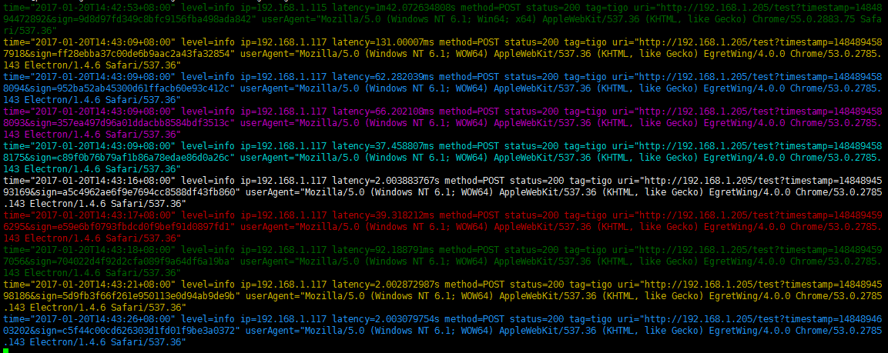

# logview

Logview is tool for formatting the color of text output to a terminal. Only support *unix.

# Usage

1.Download bin/logview, or download source code and build.

2.Run *unix command, such as: ./logview xxx(shell command like cat/tail)

# Example

Shell command:
`tail -f xxx.log`

Use logview like this:
`./logview tail -f xxx.log`

